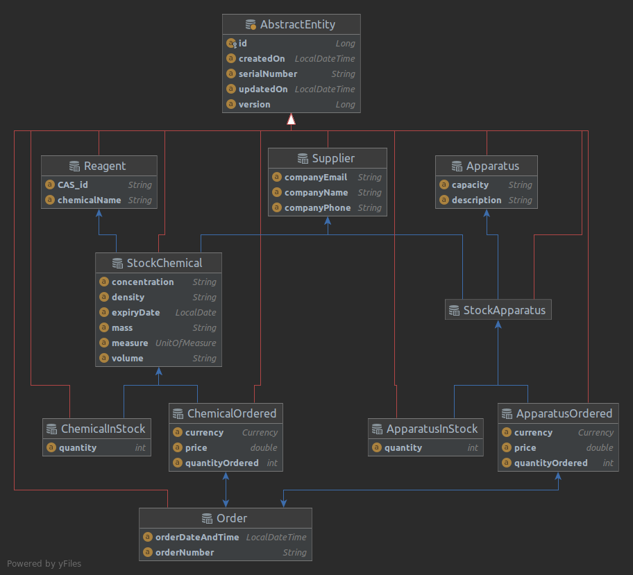

# ChemStore

ChemStore is a chemical stock and inventory database, designed as a Java EE (REST) Web service. To access use
`localhost:8080/api/v1` or from a browser `http://localhost:8080/api/v1`. Note that the port number can be changed (see
[Payara Application Server](#payara-application-server))

## JPA entities for chemicals and apparatus

The Entity relationship diagram is as follows:

All JPA entities are extensions of AbstractEntity. The key entities stored permanently are:

+ Supplier
    + Company name
    + Contact email
    + Contact phone number
+ Reagent
    + CAS ID
    + Name
+ Apparatus
    + Name
    + Capacity
  
The stock items are then related to the supplier via one-to-one relational mappings:

+ StockChemical
    + Reagent (one-to-one)
    + Supplier (one-to-one)
    + Unit (enum)
    + Expiry Date
    + Density
    + Concentration
+ StockApparatus
    + Apparatus (one-to-one)
    + Supplier (one-to-one)
  
With the above records put in place, the end-user will eventually be expected to keep a record of current stock:

+ Chemical stock
    - StockChemical (one-to-one)
    - Quantity
+ Apparatus stock
    - StockApparatus (one-to-one)
    - Quantity

The (purchase) Order is composed of Lists of ApparatusOrdered and ChemicalOrdered:

+ ApparatusOrdered
  - Order (many-to-many)
  - StockApparatus (one-to-one)
  - Quantity ordered
  - Price
  - Currency (enum)

+ ChemicalOrdered
  - Order (many-to-many)
  - StockChemical (one-to-one)
  - Quantity ordered
  - Price
  - Currency (enum)

Hence, ApparatusOrdered and ChemicalOrdered are individual rows of Order:

+ Order
  - Order date and time
  - (List of) ApparatusOrdered (many-to-many)
  - (List of) ChemicalOrdered (many-to-many)
  
The mappings are many-to-many since it is likely that the same quantity of apparatus and/or reagents will be requested again.

# Payara Application Server

ChemStore is designed to run over the Payara Application Server. To build a fat JAR file with the Payara server embedded, 
execute `mvn clean package` from the project parent directory. To run the app, enter `java -jar ChemStore-1.0-SNAPSHOT-microbundle --port 5000`, noting
 that the port parameter is optional.

# EclipseLink

ChemStore uses the EclipseLink ORM with the H2 embedded database.

# Future capabilities of ChemStore

## Teacher submitted lab requirements

The teacher can submit a request sheet for a class, for classes taking the same experiment, saving the instructions for
future use:

+ Teacher chemical request facility
    - Date of request
    - Date/week of experiment(s)
    - Number of students
    - Number of surplus quantities
    - Chemicals required
        + Chemical name
        + Quantity per student
    - Apparatus required
        + Apparatus name
        + Capacity

## Reagent quantities calculator

The school/college technician can also make use of a reagent quantities calculator:

+ School technician reagent quantities and dilutions calculator
  - Molar/formula mass
  - Stock concentration
  - Volume per student
  - Number of students + surplus
  - OUTPUT: volume/mass required